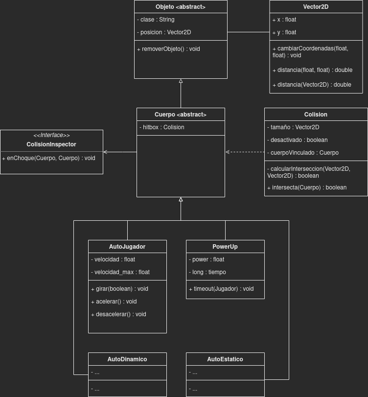

# Road Fighter - Diagrama

  

## TODO:
    • Controles:
        ◦ Crear controles para el Menu.
    • Graficos:
        ◦ Diseñar menu con ajustes de sonido (SFX y Musica).
        ◦ PowerUp sprite.
        ◦ Obstaculo sprite.
        ◦ Desarrollar las animaciones:
            ▪ De choque entre autos.
            ▪ De choque contra un borde (Jugador y AutoEstatico).
            ▪ De choque contra un obstaculo (Jugador y AutoEstatico).
            ▪ De jugador recogiendo un power up.
            ▪ De jugador cruzando la meta.
    • Logica:
        ◦ Crear MenuScene.
        ◦ Separar Jugador local de competidores.
    • Actualizar diagrama.